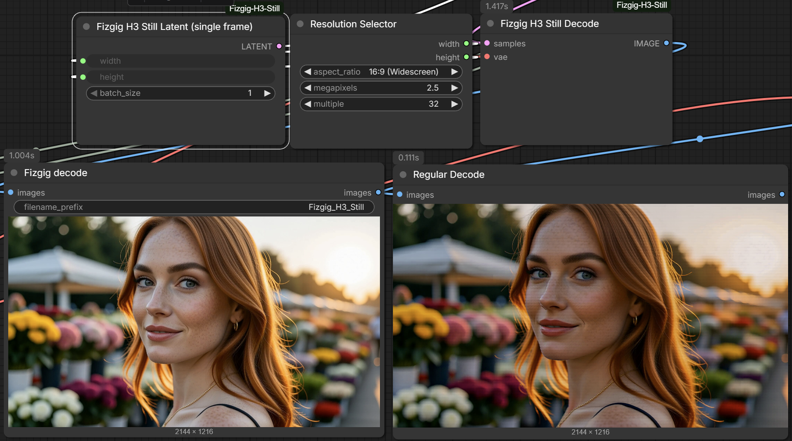
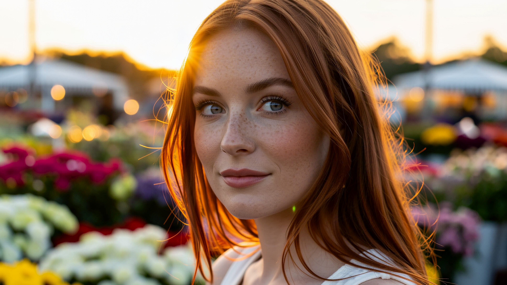

# Fizgig H3 Still

[](https://buymeacoffee.com/lorasandlenses)
[](LICENSE)

Two nodes that make **MiniMax H3** render true single-frame stills in ComfyUI: crisp, clean images at any size, with no banding. No extra models, no LoRA.



*Left: Fizgig H3 Still Decode. Right: the stock VAE Decode. Same seed, 2144×1216.*

## Why do I need it?

H3 is a video model, but its native image is a single frame, and ComfyUI doesn't render one properly:

- The stock H3 latent is at least 5 frames long, so a "still" is really the first frame of a short clip.
- Decoding a lone frame with the stock **VAE Decode** gives banded, streaky images.

**Fizgig H3 Still Latent** makes a true one-frame latent, and **Fizgig H3 Still Decode** decodes it cleanly. Both come from how Fizgig renders H3 still previews.

**What about the dedicated single-frame VAE?** There's a separate H3 single-frame VAE (`minimax_h3_t1_image_vae_step1597_int8_convrot.safetensors`). In our tests it's slower and softer, with less skin detail. Fizgig H3 Still Latent and Still Decode are faster and keep the detail, so there's no reason to use it with these nodes.

## How do I install it?

```
cd ComfyUI/custom_nodes
git clone https://github.com/shootthesound/ComfyUI-Fizgig-H3-Still
```

Restart ComfyUI. Both nodes are under the **Fizgig** category. No extra Python dependencies. They run on ComfyUI's built-in MiniMax H3 support.

## How do I use it?

Start from any H3 text-to-video graph and change two things:

1. **Fizgig H3 Still Latent** → the sampler's latent input. Keep **MiniMax H3 Image to Video** for its conditioning and leave its LATENT output unconnected. Feed both nodes the same width and height.
2. **Fizgig H3 Still Decode** in place of **VAE Decode**. Same inputs: the sampler's output and the video VAE.

```
MiniMax H3 Image to Video (conditioning) ─► BasicGuider ─┐
Fizgig H3 Still Latent ──────────────────────────────────┼─► SamplerCustomAdvanced ─► Fizgig H3 Still Decode ─► Save Image
```

## Is there an example workflow?

Yes, several. The main one: [`example_workflows/h3_still_text_to_image.json`](example_workflows/). It renders a 2.5 MP widescreen still. It decodes twice, once with **Fizgig H3 Still Decode** and once with the stock **VAE Decode**, so you can see the difference side by side. Load it from ComfyUI's Templates browser (it appears under this pack's name), or drag the JSON onto the canvas.

It uses the **v4 step-600 EMA** Turbo LoRA from [larryvrh/MiniMax-H3-Turbo-Lora](https://huggingface.co/larryvrh/MiniMax-H3-Turbo-Lora) (`minimax_h3_turbo_v4_step600_ema.safetensors`) at strength **0.38**, with 20 steps and the `er_sde` sampler. That combination works best for stills. You can also bypass the Turbo LoRA and render without it.

For the highest quality, [`example_workflows/h3_still_text_to_image-8MP-NoTurboVersion.json`](example_workflows/) renders an **8 MP** widescreen still with **no Turbo LoRA** (its strength is set to 0), at 50 steps with `er_sde`. It's much slower, but it shows how far the two nodes go:



*8 MP (3872×2176), no Turbo LoRA, 50 steps, Fizgig H3 Still Latent + Still Decode.*

Model files, all from [Comfy-Org/MiniMax-H3](https://huggingface.co/Comfy-Org/MiniMax-H3):

- `diffusion_models/minimax_h3_fl2va_pruned_int8_convrot.safetensors`
- `text_encoders/qwen3vl_32b_minimax_h3_nvfp4_awq.safetensors`
- `vae/minimax_h3_video_vae_int8_convrot.safetensors` (the fp16 VAE works too)

## Can it edit images?

Yes. There's also an edit workflow included, [`example_workflows/Edit_Workflow_example.json`](example_workflows/), which shows the model already has some edit abilities. Load a photo, refer to it as `<Picture 1>` in the prompt and describe the change, for example *"<Picture 1> and Change the dress to red. Keep her identity the same."* **MiniMax H3 Reference to Video** supplies the conditioning, and the two Fizgig nodes render and decode the result as a single still.

The upscale to 2.5 MP in the edit workflow is intentional: editing seems to work best at that size.

The workflow uses the same model files and Turbo LoRA as the text-to-image example, plus **AILab_ImageResize** from [ComfyUI-RMBG](https://github.com/1038lab/ComfyUI-RMBG) to size the input photo.

## What sizes can it do?

Any width and height that are multiples of 32. The decode is tiled, so large images don't need a large card. It decodes a few tiles at a time, or one at a time when VRAM is tight.

## Does it work with clips?

The latent node is for stills only. The decode node passes anything longer than one frame straight to the stock decode, so leaving it in a clip workflow does no harm.

## Support

If this tool saves you time or fits into your workflow, consider
[buying me a coffee](https://buymeacoffee.com/lorasandlenses).

Your support helps me keep developing and maintaining these nodes. Members get
early access to new builds before public release.

[](https://buymeacoffee.com/lorasandlenses)

## Author

Peter Neill — [ShootTheSound.com](https://shootthesound.com) / [UltrawideWallpapers.net](https://ultrawidewallpapers.net)

Feedback is welcome — open an issue or reach out.

## License

MIT
